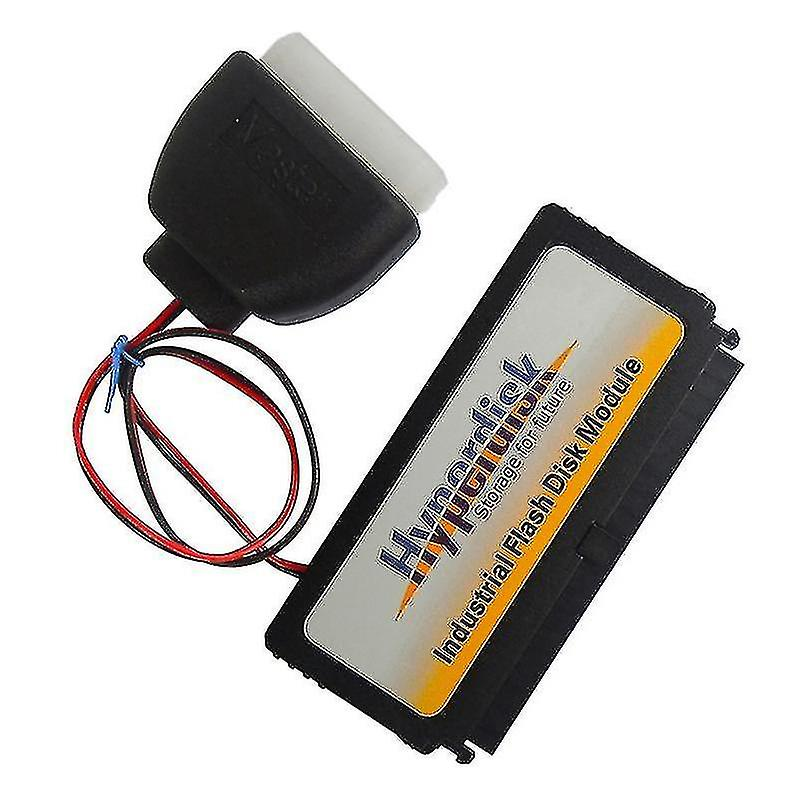
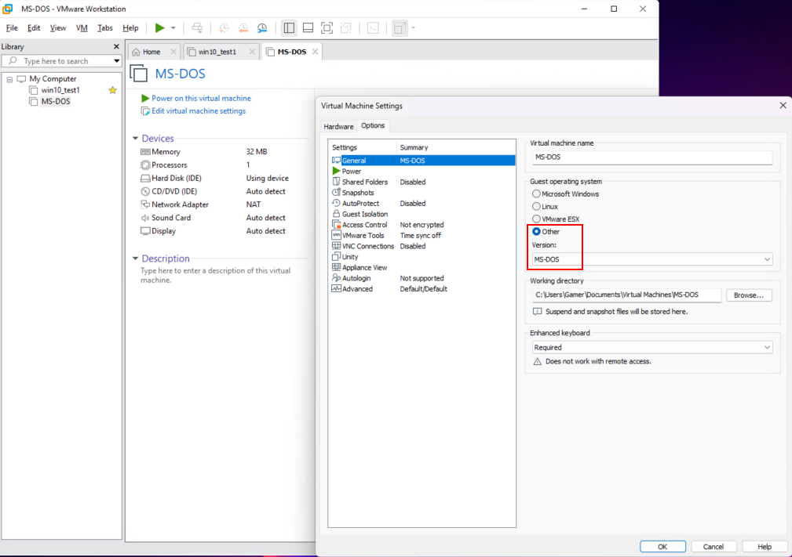
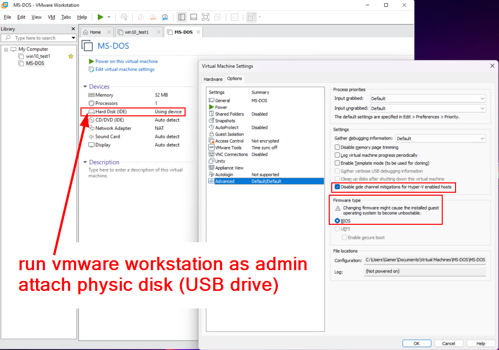
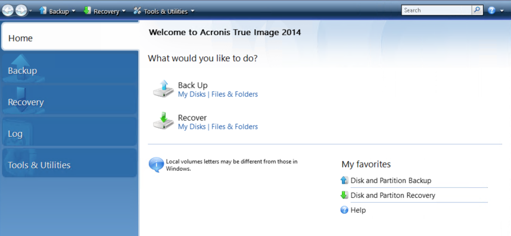
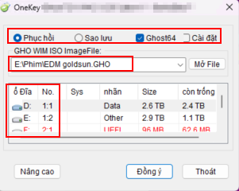

# HyperDiskImages

<table>
    <tr>
        <td width="99999" align="center">This project is <b>backup</b> of disk image of machines.</td>
    </tr>
</table>

 

This project content IMAGE files, All of them was cloned from running CNC, EDM machines. 
- Some of them was from floppy disk
- Somes from IDE HDD, Memory card and Hyperdisk.

Most of them was running `MS DOS` OS, some was `UNIX`.

## VM 

For testing IMAGE running issue.

### VM Boot

## Acronis

Working with **.TIB** file

## Onekey ghost

Working with **.gho** file

## Tools

hyper x [3 nghìn] [gạch dưới]

## Ref

RS232-Data-Logger-master

open-serial-port-monitor-master

ttermp23

Advanced Serial port monitor
- AGG Software
- aspmon4_2wEi41

Modbus RTU,TCP simulator    
- Conrad Braam; 
- Modbus RTU,TCP and AB-FD1 simulator install

WinCC_Profestional_V14-005
- SIMATIC_WinCC_Professional_V14
- SIMATIC_STEP_7_Professional_V14